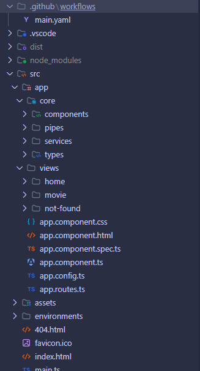

# Movie Search Gml

Link del proyecto deployado: https://crisantizan.github.io/movie-search-gml 🚀

## Sobre este proyecto
Esta aplicación se crea como requerimiento de una prueba técnica de GML a la vacante de Desarrollador Frontend.

## Comentarios
Lo primera duda, en cuál versión de Angular realizarlo. Se me pasó por la cabeza usar una versión anterior como la 16 o 15, ya que la mayoría de proyectos actuales están sobre esas, pero sinceramente hace rato llevo esperando la oportunidad de implementar la v17 por todas las mejoras que trae, no solo a nivel de implementaciones técnicas del framework, sino la experiencia de desarrollo, mejora mucho; por lo que sí, me decidí por la v17, pero dejando ciertos features por fuera como las señales, intenté utilizar un poco más la manera tradicional rxjs.

Decidí no implementar librerías externas de componentes o de estilos, todo está hecho por mí mismo. Esto mismo me impidió implementar ciertas mejoras gráficas al componente de movies (falta de tiempo).

El sincronizar el estado de app con la ruta de manera bidireccional fue el reto más exigente que me encontré, más que todo porque me tocó refactorizar el componente de paginación para que estableciera los valores obtenidos de la URL.

Casi olvido el único stop que tuve durante horas: deployar automáticamente en GitHub pages. Sinceramente me tomó mucho más tiempo del esperado, a priori pensé sería una experiencia similar a Netlify, pero ni al caso, y decidí seguir intentándolo, porque quería dejarlo todo integrado en esta plataforma, además, tocó desempolvar esos conocimientos en infra, fue genial cuando por fin pude ver esta app arriba y que los cambios se aplicaran solo haciendo push. Pero la dicha demoró muy poco, al final me entero que GP no funciona bien con aplicaciones SPA, no se pueden establecer las rutas directamente desde la URL. 💀 A la final casi me rindo hasta que vi que había una manera customizando el index.html y el 404.html, se logró, aunque costando SEO, cosa que no era necesaria acá.

La estructura de carpetas luce así:

- .github: configuración de GitHub actions para realizar un build automático y deployar en GitHub pages.
- src/core: acá dejo todo aquello que será usable por toda la aplicación: componentes (que no representan una vista de la app), pipes, servicios y archivos de tipado.
- src/views: aquí incluyo aquellos componentes que renderizan una vista en la app: home (vista principal), movie (el detalle de una película) y el infaltable not found.

Este proyecto fue generado con  [Angular CLI](https://github.com/angular/angular-cli) versión 17.3.5.
